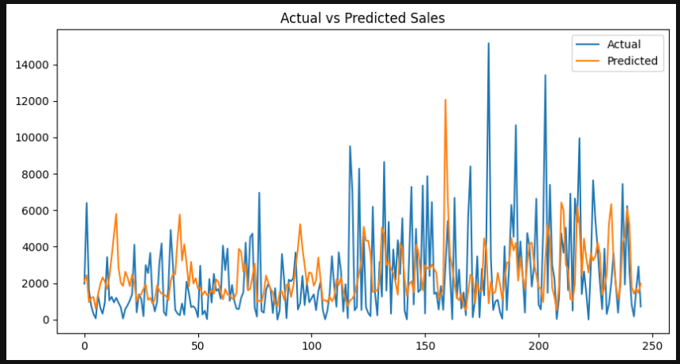

# Retail Sales Forecasting & Demand Analysis using Machine Learning

## Objective
Build a machine learning model to forecast retail sales using historical transaction data and identify key time-based drivers of sales performance.

## Tools Used
- Python
- Pandas
- Scikit-learn
- Matplotlib

## Project Workflow
1. Loaded and cleaned retail sales data
2. Converted order dates and created time-based features
3. Aggregated data at the daily level
4. Built a Random Forest regression model
5. Evaluated predictions using MAE and RMSE
6. Analyzed feature importance to understand sales drivers

## Model Performance
- MAE: 1835.63
- RMSE: 2576.69

## Key Insights
- Day of the month was the strongest feature in the forecasting model.
- Day of the week and month also played significant roles in sales prediction.
- The model captured general sales trends, though some larger daily deviations remained.
- Calendar-based demand patterns appear to be important in retail sales planning.

## Project Preview

## Project Files

Full project files available here:

[Google Drive Link](https://drive.google.com/drive/folders/1SdfF6E6MI08y107BO8hQwAr0wOTzW5jd?usp=sharing)

## Conclusion
This project demonstrates practical machine learning, feature engineering, sales forecasting, and business-oriented interpretation of model results.
